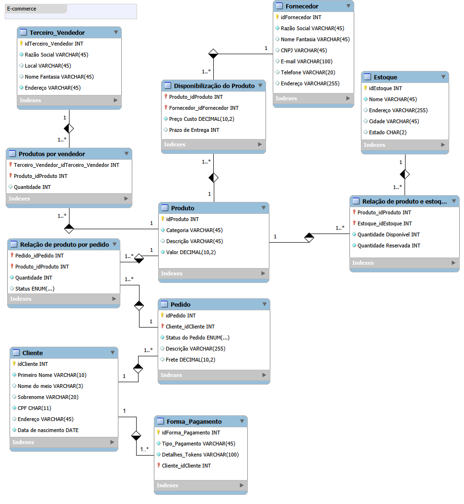

# 🛒 E-Commerce Relational Database Project (Refined)

Desafio de projeto prático focado na modelagem lógica e refinamento de um banco de dados para o cenário de **E-commerce**, proposto no bootcamp de Banco de Dados da DIO. O objetivo principal foi aplicar mapeamento conceitual-lógico, normalização e construir queries SQL complexas para extração de inteligência de negócios.

---

## 🎯 Refinamentos Implementados (Regras de Negócio)

Para elevar a complexidade e aproximar o projeto do cenário real de mercado, a modelagem base foi estendida com os seguintes refinamentos solicitados:

1. **Generalização/Especialização de Clientes (PF vs PJ):** - Centralização dos dados comuns no nó pai (`clients`).
   - Ramificação em duas tabelas filhas exclusivas com chaves estrangeiras herdadas: `physical_client` (com restrição de CPF único) e `juridical_client` (com restrição de CNPJ único). Uma conta pode ser PF ou PJ, mas nunca ambas simultaneamente.
2. **Gestão de Múltiplas Formas de Pagamento:**
   - Criação da tabela de suporte `client_payments`, permitindo ao usuário mapear e salvar múltiplos cartões ou métodos.
   - Implementação da tabela associativa `order_payment_split` para permitir o rateio de pagamentos por pedido (ex: pagar parte com saldo PIX e o restante no Cartão).
3. **Módulo de Entregas (`delivery`) Desacoplado:**
   - Separação da lógica de frete e status de dentro do pedido para uma tabela independente.
   - Suporte a controle de rastreio (`TrackingCode`) único e atualização fina dos status logísticos (*Em trânsito, Postado, Entregue*).

---

## 🛠️ Como Executar o Projeto

Os scripts foram divididos de forma semântica seguindo boas práticas de desenvolvimento:

1. Execute o script de estrutura (DDL):
   - Localizado em: [`schema_relacional_ecommerce.sql`](./src/schema_relacional_ecommerce.sql)
2. Execute o script de população de dados e relatórios (DML/DQL):
   - Localizado em: [`queries_and_data_insertion.sql`](./src/queries_and_data_insertion.sql)

---

## 🔍 Inteligência de Negócio: Queries Respondidas

O projeto conta com consultas customizadas simulando relatórios gerenciais reais, cobrindo o uso obrigatório de cláusulas como `WHERE`, `ORDER BY`, `HAVING`, junções múltiplas e funções agregadoras:

* **Métrica de Engajamento:** *Quantos pedidos foram feitos por cada cliente cadastrado?* (Faz consolidação de strings dinâmicas usando `COALESCE` e `CONCAT` para exibir tanto o nome da pessoa quanto a razão social da empresa de forma transparente).
* **Conflito de Interesses (Compliance):** *Algum vendedor terceirizado (seller) também atua como fornecedor de atacado?* (Validação cruzada de CNPJs via `INNER JOIN`).
* **Valor de Ativo Fixo:** *Quais produtos possuem estoque elevado e qual o valor financeiro total parado por galpão?* (Uso de **Atributo Derivado** multiplicando estoque por preço unitário).
* **Faturamento por Categoria:** *Quais nichos de produtos faturaram acima de R$ 100,00 líquidos?* (Aplicação fina da cláusula de agrupamento restritivo `HAVING`).

---

## 🖼️ Demonstração do diagrama EER:

---

## ✒️ Autor

- **Victor Hugo Nogueira** - [Meu GitHub](https://github.com/victornogueira11)
